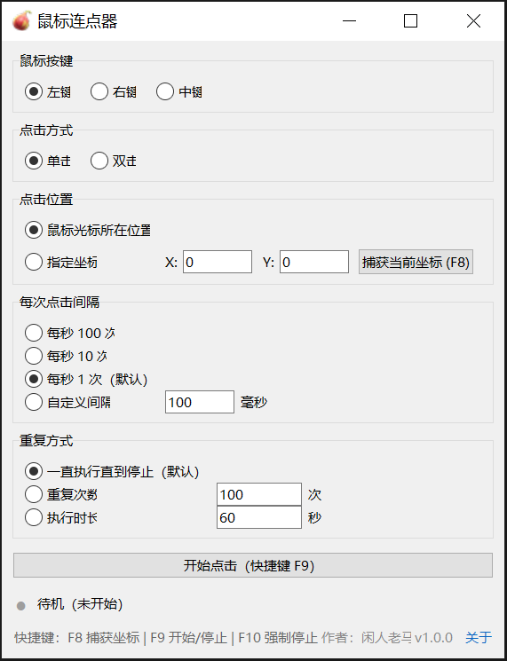

# 鼠标连点器

一个 Windows 桌面鼠标连点器，使用 Python + Tkinter + ctypes 开发，调用 Windows 原生 API，无需安装第三方 Python 包。

[]

## 功能

- 鼠标按键：左键、右键、中键
- 点击方式：单击、双击
- 点击位置：鼠标光标所在位置、指定坐标
- 点击速度：每秒 100 次、每秒 10 次、每秒 1 次、自定义毫秒间隔
- 重复方式：一直执行、重复次数、执行时长
- 全局快捷键：F8 捕获坐标，F9 开始/停止，F10 强制停止
- 配置自动保存到 `%APPDATA%\FigAutoClicker\settings.json`（商店打包版会被系统重定向到包私有目录）

## 运行

确保 Python 3.10+ 已安装，且包含 Tkinter。然后在项目目录执行：

```powershell
python .\autoclicker.py
```

也可以双击 `run.bat`。

## 打包成 Windows 应用程序

推荐使用 PyInstaller，本项目没有第三方依赖，打包过程比较简单。

### 安装 PyInstaller

```powershell
python -m pip install pyinstaller
```

### 打包成单个 exe

在项目目录执行：

```powershell
python -m PyInstaller --noconfirm --clean --onefile --windowed --name FigAutoClicker autoclicker.py
```

参数说明：

- `--onefile`：打包成单个 exe
- `--windowed`：启动时不显示黑色命令行窗口
- `--name FigAutoClicker`：输出文件名为 `FigAutoClicker.exe`
- `--clean`：清理旧的临时文件

打包完成后，可执行文件位于：

```text
dist\FigAutoClicker.exe
```

### 打包成文件夹版

如果希望启动更快，或减少杀毒软件误报，可以不使用 `--onefile`：

```powershell
python -m PyInstaller --noconfirm --clean --windowed --name FigAutoClicker autoclicker.py
```

输出目录为：

```text
dist\FigAutoClicker\
```

### 添加程序图标

准备一个 `.ico` 文件，例如 `app.ico`，然后执行：

```powershell
python -m PyInstaller --noconfirm --clean --onefile --windowed --name FigAutoClicker --icon app.ico autoclicker.py
```

建议 `.ico` 包含 `256x256` 尺寸，以便在 Windows 桌面上清晰显示。

项目已附带 `app.ico`，可直接用于上面的命令。如果想重新生成图标，可执行：

```powershell
python .\make_icon.py
```

### 打包后注意事项

- 配置仍保存到 `%APPDATA%\FigAutoClicker\settings.json`，商店打包版会被系统重定向到包私有目录并在卸载时清理。
- 单文件版第一次启动会稍慢，因为需要先解压临时文件。
- 如果要点击以管理员身份运行的程序，请右键 `FigAutoClicker.exe` 并选择“以管理员身份运行”。
- 如果杀毒软件误报，可改用文件夹版或添加信任。

## 上架微软商店（MSIX）

商店目前支持两条提交路径：MSIX 打包（微软免费代签、免费托管、系统自动更新）和
直接提交 EXE/MSI 安装包（需要自己购买代码签名证书、自建 HTTPS 下载地址）。
本项目采用 MSIX 路线，相关文件都在 `packaging\` 目录下。

商店版与免安装版有两处行为差异，上架前需要知晓：

- MSIX 应用固定以普通用户权限运行，无法“以管理员身份运行”，因此不能点击以管理员
  权限运行的程序，这一点需要在商店描述里作为已知限制写明。
- 打包后写入 `%APPDATA%` 的内容会被重定向到包私有目录，并在卸载时一并清理。

### 1. 注册开发者账号

打开 <https://storedeveloper.microsoft.com>，选择 “Get started for free”，用个人
Microsoft 账号注册 Individual 开发者账号（当前免注册费），按提示用政府证件加自拍
完成身份验证，然后进入 Partner Center。

### 2. 预留应用名称

在 Partner Center 的 “Apps and games” 中新建产品并预留名称，名称需要全商店唯一。
之后在“产品管理 → 查看应用身份详细信息”里可以看到三个值：
`Package/Identity/Name`、`Package/Identity/Publisher`、
`Package/Properties/PublisherDisplayName`。

### 3. 填写身份并打包

把上面的值填进 `packaging\store-identity.json`，然后执行：

```powershell
powershell -ExecutionPolicy Bypass -File .\packaging\build_msix.ps1 -RequireIdentity
```

脚本依次完成：PyInstaller onedir 打包 → 生成图标资源 → 组装打包目录 → 调用
Windows SDK 的 makeappx，最终得到 `dist\msix\FigAutoClicker_<版本>_<架构>.msix`。

几点说明：

- 需要 makeappx.exe，脚本会自动从 `C:\Program Files (x86)\Windows Kits\10\bin`
  查找；也可以用 `-MakeAppx` 指定。
- 想先在本机试装，可以加 `-SelfSign` 用自签名证书签名，把导出的
  `dist\msix\FigAutoClicker-Dev.cer` 导入“受信任人”证书存储后执行
  `Add-AppxPackage`。
- 图标资源由 `packaging\make_msix_assets.py` 从 `app_preview.png` 生成，结果存放在
  `packaging\assets\`，已经随仓库提交，换图标后重新运行脚本即可。
- 商店列表用的图片（300×300 磁贴图标、截图等）放在 `packaging\store-images\`，
  这个目录不参与打包，图片不会进入 MSIX 包。
- 只想出免安装版本时，`FigAutoClicker.spec` 现在也是 onedir 配置，直接
  `python -m PyInstaller --noconfirm --clean FigAutoClicker.spec` 即可。

### 4. 版本号怎么改

版本号只在 `autoclicker.py` 的 `__version__` 里维护一处（当前是 `1.0.0`）：

- 应用页脚显示的 `v1.0.0`、「关于」对话框、exe 属性里的文件版本与产品版本，
  以及 MSIX 的四段包版本 `1.0.0.0`，全部由这一个值派生。
- 上架新版本时把第三位加一（`1.0.0` → `1.0.1`），第四位保持 0。商店要求每次
  提交的包版本必须比上一版大，所以不要只改界面上的显示。
- 特殊情况下需要用别的包版本，可以在打包时加 `-PackageVersion 1.0.1.0` 覆盖。

### 5. 提交审核

在 Partner Center 上传 `.msix` 并填写商店信息，`packaging\store-listing.md` 里准备了
描述、搜索词、系统要求、受限能力说明和认证备注的文本模板。

两个容易踩的点：

- 清单声明了 `runFullTrust` 受限能力，提交时 Partner Center 会要求说明用途，
  认证因此可能多花几天。
- 类别选“实用工具和工具 / 生产力”，不要选游戏；描述中不要出现游戏挂机或作弊
  相关的表述，否则容易被判定违规。

## 使用说明

1. 选择鼠标按键、点击方式、点击位置和速度。
2. 如果选择“指定坐标”，可点击“捕获当前坐标”或按 F8 自动填入当前鼠标位置。
3. 点击“开始”或按 F9 开始，再次点击“停止”或按 F9 停止。
4. 如果出现异常，按 F10 可强制停止。

## 注意事项

- 如果想点击以管理员身份运行的程序，本工具也需要以管理员身份运行。
- 自定义间隔最低支持 1 毫秒；过低间隔会占用较多 CPU。
- 双击模式会先在两次点击之间等待约 30 毫秒，因此实际“动作次数/秒”会低于极高频率设置。
- 如果 F8/F9/F10 已被其他程序占用，状态栏会提示注册失败。

## 核心实现

- `SendInput`：模拟鼠标输入
- `SetCursorPos` / `GetCursorPos`：移动或读取鼠标位置
- `RegisterHotKey`：注册全局快捷键
- `timeBeginPeriod(1)` / `timeEndPeriod(1)`：提高定时精度
- 独立后台线程执行点击任务，避免阻塞界面

## 隐私政策

本应用不收集、不存储、不传输任何个人信息，也不联网，仅在本地保存您的设置。
完整说明（中英文）见 [PRIVACY.md](PRIVACY.md)。

## License

[](LICENSE)

This project is licensed under the MIT License - see the [LICENSE](LICENSE) file for details.
